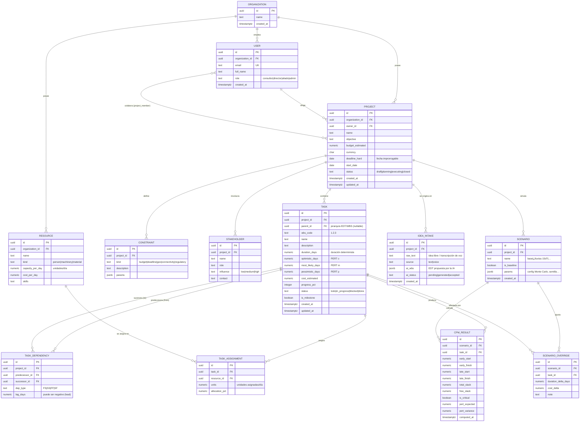

# Campo Crítico — Modelo de datos (Entidad–Relación)

Base de datos relacional (**PostgreSQL**). El grafo de tareas se modela con la tabla
`task_dependency` (aristas dirigidas), que junto con `task` (nodos) forma el **DAG** sobre el
que corre el motor CPM/PERT.

## Diagrama ER (Mermaid)

## Notas de diseño

- **DAG e integridad:** `task_dependency` no puede crear ciclos. Se valida en la capa de
  aplicación (motor CPM detecta ciclos) y opcionalmente con un *trigger* o una consulta recursiva
  (`WITH RECURSIVE`) antes de insertar.
- **Jerarquía EDT:** `task.parent_id` modela la estructura de desglose; las hojas son las tareas
  planificables y las ramas son agregados (resumen).
- **Escenarios:** el escenario `is_baseline = true` es el plan real. Las simulaciones
  ("¿qué pasaría si…?") se representan con `SCENARIO` + `SCENARIO_OVERRIDE` sin tocar las tareas
  base, y sus resultados se guardan en `CPM_RESULT` para comparar.
- **EVM / avance:** `task.progress_pct`, `cost_estimated` y `task_assignment` alimentan el cálculo
  de PV/EV/AC en el dashboard.
- **Offline:** cada tabla mutable lleva `updated_at`; el cliente encola cambios y sincroniza por
  *last-write-wins* a nivel de campo.

Ver el DDL completo en [`db/schema.sql`](../db/schema.sql).
